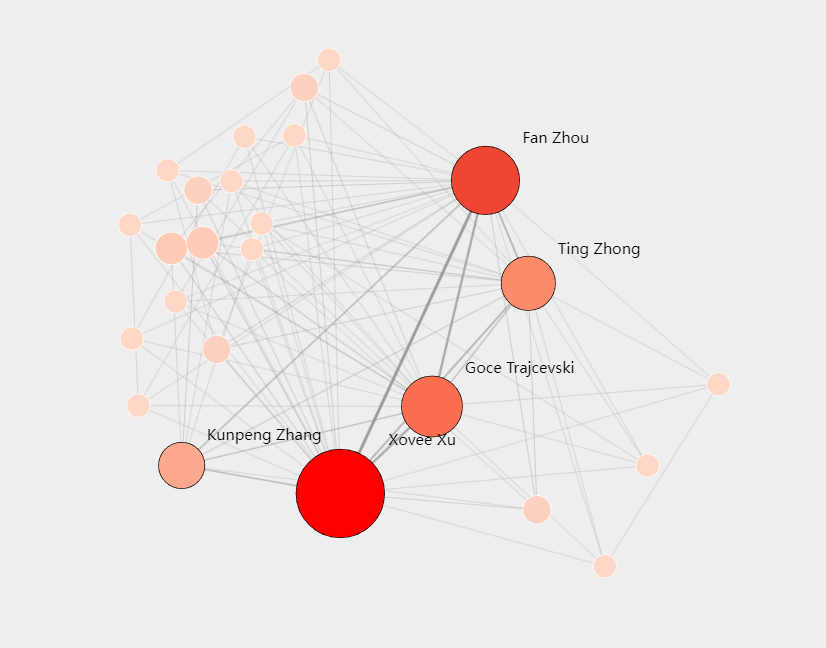
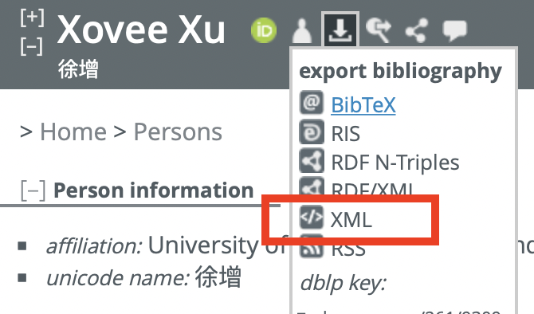
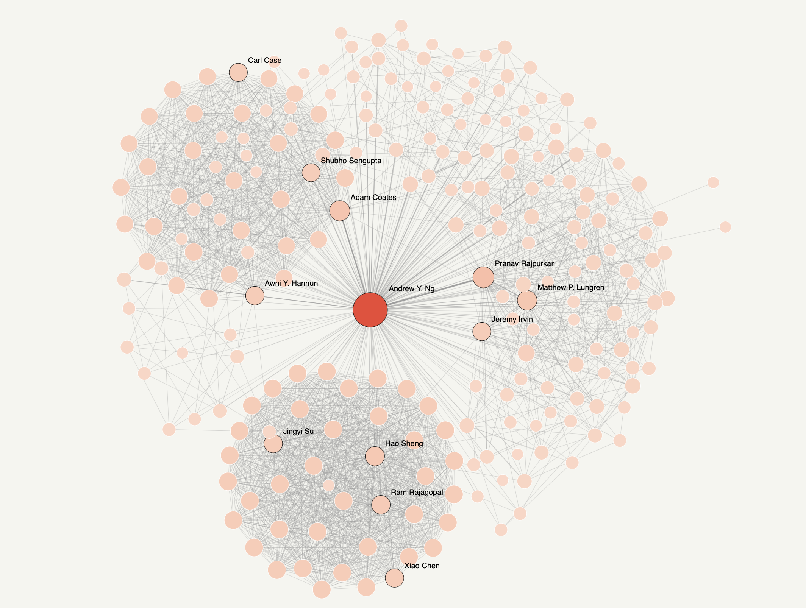

# CANV: Co-Authorship Network Visualization



CANV is an interactive co-authorship network visualization tool (a.k.a. collaboration graph) based on [webweb](https://github.com/dblarremore/webweb). See an example above (my network) or at [here](https://xovee.cn/canv.html). You can use this tool to create a standalone webpage containing your co-authorship network. 

## Dependency

```shell
pip install -r requirements.txt
```

## Usage

You can create your co-authorship network with a few easy steps in no time.

1. Open your [Google Scholar](https://scholar.google.com/) or [dblp](https://dblp.org) author page, download 
your bibliographic data, e.g., `xovee-xu.bib` or `xovee-xu.xml`  


2. Run [canv.py](./canv.py), then you have `xovee-xu.html`, that's all! 
```shell
> python canv.py xovee-xu.bib
```

## Option

There are several options you can customize your CANV page. For example, control the number of names show in the canvas. 
```shell
> python canv.py --help
```

## Deep Customization

You can directly edit [template.html](./template.html) to deeply customize your page. Some examples:
- If you want to change node colormap, search `d3.interpolateReds(webweb.scales.colors.scalar(x))` in [template.html](./template.html) and replace it within the color you like.
- If you want to regularize node color/size values, modify the `getRawNodeValues()` function, e.g., `rawValues[i] = val;` to `rawValues[i] = Math.log(val)`


## More Examples

- Prof. [Andrew Y. Ng](https://xovee.cn/html/canv/andrew-y-ng.html)


## Acknowledgment

Thanks to [webweb](https://github.com/dblarremore/webweb) and [dblp](https://dblp.org) team.

## LICENSE

GPL-3.0 License

## Contact

If you notice any bugs or have suggestions, please contact me at `xovee at ieee.org`
